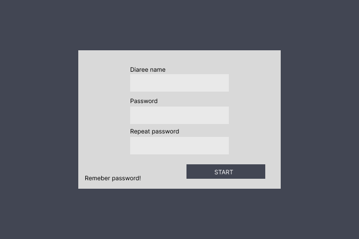
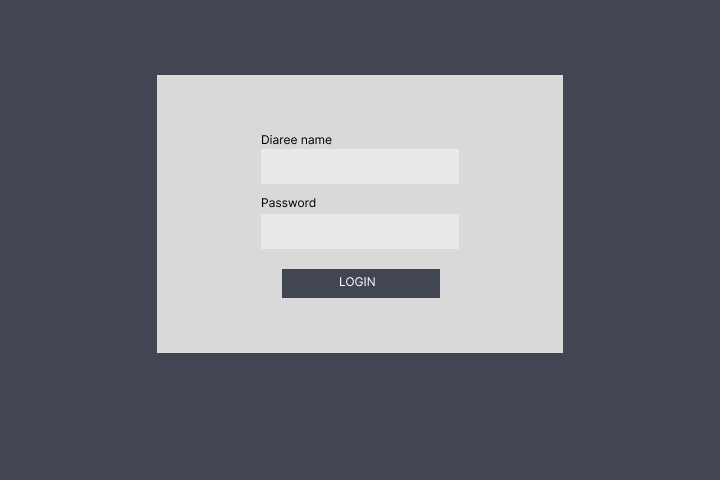
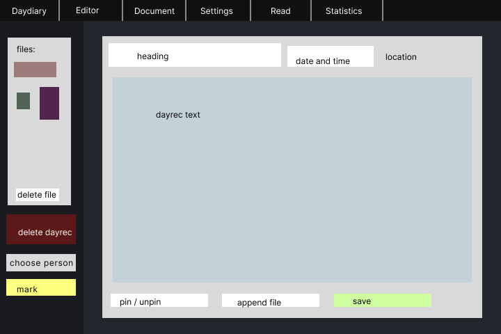
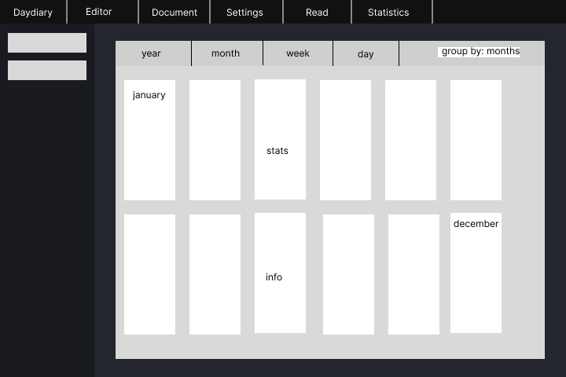

# REQUIREMENT GATHERING
## 1. Summary
This document serves as an overview of what the requirements are for the final project *DayDiary*. 
In second section a clue is given about what we want of the end product to be. Here functional and non-functional requirements are seperatly presented. They are well described and explained later on in sixth and seventh section of this document respectively. Functional and non-functonal requirements are graphically represented on *use case diagram*. User roles that are involved in the program are defined and desciribed in the third section. Terms concerning this document and DayDiary application are defined and described next in fourth seciton. Penultimate section gives us a sense about what the application will look like. These images are *screen wireframes* which represent the user graphicall interface of application. *Interfaces to External Systems* which define and describe relations between DayDiary and external systems will be presented lastly in this docmuent.

## 2. Introduction
DayDiary will offer a solution for a well trusted **confidential** digital diary. It will serve as a comftrable environment with a calendar view of dayrecs.

Representation of ***functional requirements***:\
Simple searching with a keyword on all text will be included. Editing already entered text will be supported as well as deleting the diary input. User will be expected to save input manually. In case the user forgets to save the unsaved changes, the program should inform user about the potential data loss.\
Individual diary inputs will have an option of appending an image to it. `Pinning` specific diary will offer a quick access to it in case user wants to see that specific diary entry later on. DayDiary will offer a functionality to mark the text and add a graphical effect to it, in case text was shown to someone. Marking the text can be style (color) specific based on who it was shown to.\
Exporting text as pdf document in span of custom date will be supported in order to print a diary.\
Every user authentication will be logged and visible to authorized owner. User input will be mathematically analyzed and visible to user in graphical form with charts. Text will be processed and analyzed and will offer user a linguistic analysis in a way to improve their expression and vocabulary.

Representation of ***non-functional requirements***:\
Program will support only one diary entry for each calendar day. Diary will be stored in a cloud service.
DayDiary will be reiliable: diary entries will be saved and encrypted in a retrievable way without loss or corruption of data. Application will be usable on all operating systems (Linux, Windows, MacOS). Only english language will be supported for use of this program.\
Optionally individual user will be able to customize stylish settings such as application background, fonts, etc.\
The final package of the program should be easy to install and use. Users should be provided with well documented functionalities.

## 3. User Roles
DayDiary's user roles and relations between them will be quiet simple.
- **Diaree** - an authorized user of diary: can log in and out of program, use functionalities of DayDiary and is authorized to edit, delete and change user data.
- **Visitor** - an unauthorized user that can only view list of daydiary functionalities. Can see functionalities and workflow of application.
*Visitor* has a potential to become *Diaree*.

## 4. Glossary of Terms
In filed of writing a diary there are not many technical terms. However, there will be some additional due to DayDiary program and project specifics.

**Diary** - a personal record or journal where individuals can document their thoughts, experiences, and events. Represents set of all DayRecs in this application.\
**Dayrec** - a unique and individual record within a diary or journal that captures the events, thoughts, or experiences usually of a specific day\
**Diaree** - user of *DayDiary* and author of *Dayrec*s\
**Dayrec metadata** - information associated with each entry, such as date, location and heading\
**Heading** - a word or phrase best describing the *dayrec*\
**Export** - saving diary in a specific format (e.g., PDF, plain text etc.) for external use or archivning\
**Screen Wireframe** - a visual representation of a UI design, often in the form of a static image of a website page or app screen

## 5. Use Case Diagram

## 6. Functional Requirements
|Functionality label|Create Diaree|
|-|-|
|Description|Visitor can create a new diaree, which can be given a name and other specific diaree information and password.|
|Main flow|<ol><li>Visitor chooses `Create Diaree` functionality</li><li>System gives a form to fill diaree information</li><li>Visitor fills the form with personal data</li><li>Visitor requests to create a new diaree (pressing `create` button)</li><li>System shows message about successfully made diaree and logs visitor in as a diaree</li></ol>|
|Alternative flow|*none*|
|Execptional flow|<ul><li>Visitor fills unvalid data (unvalid username / already in use) in form and system requires different diaree data.</li><li>Diaree already exists. Application requires to delete the diaree.</li></ul>|
|Dependencies|Nobody should be logged in (user should be in visitor mode).|
|Aftermath|Diaree profile is made and system logs the user in as a new diaree.|
|Extra|If the diaree already exists, the frontend should not offer visitor an option to create a diaree.|
|Priority|**Must have** / Should have / Could have / Would have|
|Acceptance test|<ul><li>Create new diaree, log out, log in.</li><li>Create new diaree, exit application, choose newly created diaree and log in.</li></ul>|

|Functionality label|Delete Diaree|
|-|-|
|Description|Diaree can delete oneself. All data about the diaree is deleted. The action cannot be undone.|
|Main flow|<ol><li>Visitor logs into as a diaree</li><li>Diaree chooses `delete diaree` option in settings</li><li>System warns the diaree about a potential data loss and asks for a confirmation</li><li>Diaree confirms their action with password</li><li>System deletes all the `diaree's` data</li><li>System logs the diaree out</li></ol>|
|Alternative flow|*none*|
|Execptional flow|<ul><li>Diaree has wrong password. The deletetion of diaree is unauthenticated and does not get deleted.</li></ul>|
|Dependencies|Diaree has to exist and a diaree has to be logged in a profile to delete that profile.|
|Aftermath|All the diaree's data is removed from drive and diaree is logged out.|
|Extra|*none*|
|Priority|Must have / **Should have** / Could have / Would have|
|Acceptance test|<ul><li>Create new diaree. Log in and delete it. Deleted diaree should not be on list of diarees at login screen anymore.</li><li>Create new diaree. Log in and delete it with wrong password. Deleted diaree should be on list of diarees at login screen.</li><li>Create new diaree. Log in and delete it. Close and reopen the application. Deleted diaree should not be on list of diarees at login screen anymore.</li></ul>|

|Functionality label|Log in|
|-|-|
|Description|Visitor can access a diaree's data.|
|Main flow|<ol><li>User opens an application and has user role *visitor*</li><li>Visitor authenticates himself with password</li><li>System validates authetnication</li><li>Visitor becomes diaree</li></ol>|
|Alternative flow|<ol><li>Visitor uses a functionality `create Diaree`</li><li>System automatically logs visitor in as a newly created diaree.</li></ol>|
|Execptional flow|<ul><li>The passowrd is incorrect so the system returns a message and gives endless more opportunities.</li></ul>|
|Dependencies|*none*|
|Aftermath|User gets changes `user role` from visitor to diaree.|
|Extra|*none*|
|Priority|**Must have** / Should have / Could have / Would have|
|Acceptance test|<ul><li>Create new diaree and log in.</li><li>Create new diaree and log in with incorrect password. The system should not log one in and should return a corresponding message.</li></ul>|

|Functionality label|Authenticate|
|-|-|
|Description|Visitor or diaree can authenticate when another functionality requires authentication to be processed.|
|Main flow|<ol><li>Visitor or diaree inputs requested data for their authentication</li><li>System verifies authentiacation</li><li>Functionality is permitted</li></ol>|
|Alternative flow|*none*|
|Execptional flow|<ul><li>The entered password (diaree data) is incorrect and the request for functionality is rejected.</li></ul>|
|Dependencies|Diaree has to exist in order to authenticate|
|Aftermath|System allows diaree to use the dangerous functionalities|
|Extra|*none*|
|Priority|**Must have** / Should have / Could have / Would have|
|Acceptance test|<ul><li>Try to authenticate with correct password. The system should allow the functionality.</li><li>Try to authenticate with incorrect password . The system should not allow the functionality</li></ul>|

|Functionality label|Log out|
|-|-|
|Description|Diaree can log out of system. User role changes from diaree to visitor and user has no longer access to previously logged diaree.|
|Main flow|<ol><li>Diaree uses functionlity `log out`</li><li>System logs user out</li><li>New user role is visitor</li></ol>|
|Alternative flow|<ol><li>Diaree shuts the application down</li><li>System offers to save potentially unsaved work</li><li>System logs user out</li><li>Daydiary gets closed</li></ol>|
|Execptional flow|<ul><li>User ends the processes which runs the Daydiary forcefully and the app closes with no prompt.</li></ul>|
|Dependencies|Current user role has to be diaree.|
|Aftermath|New user role is visitor.|
|Extra|*none*|
|Priority|**Must have** / Should have / Could have / Would have|
|Acceptance test|<ul><li>Log into a system and log out. Log in again into same and different account.</li><li>Close the application and open it again and try to log in into the same account and once again into a different account.</ul>|

|Functionality label|Change settings|
|-|-|
|Description|Diaree can change their personal application settings under settings section. User input such as select button and colour picker are required. The functionality offers to set personal background colour, theme, fonts etc.|
|Main flow|<ol><li>Diaree navigates to settings section</li><li>Application offers a set of different options for each setting</li><li>Diaree chooses and sets all teh desired settings</li><li>Diaree saves changes</li><li>System stores the newly required settings</li><li>Application starts using the new settings</li></ol>|
|Alternative flow|*none*|
|Execptional flow|<ul><li>Invalid settings are handled as error and returned as an error message to user.</li></ul>|
|Dependencies|User should be logged into an account.|
|Aftermath|Graphical user interface of the application changes only for user and is changed until the same user changes it again.|
|Extra|*none*|
|Priority|Must have / **Should have** / Could have / Would have|
|Acceptance test|<ul><li>Log in and try to change every setting. Log out and see if the application is adjusted as required from previous session.</li><li>Fill the wrong input to form and test some other functionalities.</li></ul>|

<!-- 
|Functionality label|Choose diaree|
|-|-|
|Description|Visitor can choose which profile (diaree) to log in to.|
|Main flow|<ol><li>Visitor chooses to log in rather than to create a new account</li><li>System provides visitor with existing diarees</li><li>By clicking on one of the offeredd diarees, visitor chooses to use one of the profiles</li></ol>|
|Alternative flow|*none*|
|Execptional flow|*none*|
|Dependencies|At least one diaree has to exist on the system in order to choose one.|
|Aftermath|The system provides user with a form to authenticate oneself.|
|Extra|*none*|
|Priority|**Must have** / Should have / Could have / Would have|
|Acceptance test|<ul><li>Pick a profile when there are no profiles and when there is one and when there are more than one on system.</li></ul>| -->

|Functionality label|View statistics|
|-|-|
|Description|Diaree can look up his activity via this functionality. They can view all the login activity. This functionality also provides linguistically analyzed data of diaree's dayrecs.|
|Main flow|<ol><li>Diaree opens personal statistics section</li><li>System provides diaree with a compact and visual representation of diaree's analyzed personal data</ol>|
|Alternative flow|*none*|
|Execptional flow|*none*|
|Dependencies|Diaree has to be loged in.|
|Aftermath|*none*|
|Extra|*none*|
|Priority|Must have / Should have / **Could have** / Would have|
|Acceptance test|<ul><li>Change input and check if the anaylzed data has updated.</li><li>View statistics when diaree has no input for every parameter of analyzed data.</li></ul>|

|Functionality label|Edit a Dayrec|
|-|-|
|Description|Diaree can edit the content of any dayrec.|
|Main flow|<ol><li>Diaree clicks functionality on calendar or other views to enter editor</li><li>Diaree is redirected to editor mode</li><li>On save, application deletes the previous version of dayrec and creates a new dayrec with a corresponding date</li></ol>|
|Alternative flow|*none*|
|Execptional flow|*none*|
|Dependencies||
|Aftermath|Diaree has to be logged in.|
|Extra|*none*|
|Priority|**Must have** / Should have / Could have / Would have|
|Acceptance test|<ul><li>Start new dayrec. Save. Exit application and check for the new input.</li><li>Open existing dayrec and change it. Log out and log in againg and scheck for new input</li></ul>|

|Functionality label|Delete dayrec|
|-|-|
|Description|Diaree can delete any dayrec.|
|Main flow|<ol><li>Diaree clicks delete button on a dayrec</li><li>Application asks for confirmation of action</li><li>Diaree confirms deletetion</li><li>Application removes dayrec from drive</li><li>Application refreshes and dayrec is no longer visible</li></ol>|
|Alternative flow|*none*|
|Execptional flow|<ul><li>Diaree changes his mind and does not confirm deletetion. Application cancles deletetion and focuses on previous view. Dayrec is not deleted.</li></ul>|
|Dependencies|A dayrec to be deleted has to exist.|
|Aftermath|The selected dayrec does no longer exist on drive|
|Extra|*none*|
|Priority|Must have / **Should have** / Could have / Would have|
|Acceptance test|<ul><li>Create a dayrec and delete it. The dayrec should not exist anymore even after closing and opening application.</li><li>Create a dayrec and delete it. Create a same dayrec for the same date from the previously deleted one. Application should allow to create a new one and delete the new one.</li></ul>|

|Functionality label|Save Dayrec|
|-|-|
|Description|Diaree can save the local changes they made on dayrec to drive.|
|Main flow|<ol><li>Diaree clicks on save button in editor</li><li>Application encrypts the data<li>Application saves the changes to cloud</li><li>Optionally changes get saved on another drive (backup)</li></ol>|
|Alternative flow|<ol><li>Diaree presses ctrl+s in editor</li><li>Application encrypts the data<li>Appliocation saves the changes to cloud</li><li>Optionally changes get saved on another drive (backup)</li></ol>|
|Execptional flow|<ul><li>Not enough space on the drive. The application returns an error message.</li></ul>|
|Dependencies|Enough available space on drive.|
|Aftermath|Encrypted updated content of dayrec is stored on drive.|
|Extra|*none*|
|Priority|**Must have** / Should have / Could have / Would have|
|Acceptance test|<ul><li>Edit the blank dayrec and save it. The application must show the changes when opened next time.</li><li>Edit random already content-full dayrec and change it. The change should be visible right after the save functionality was used.</li></ul>|

|Functionality label|Search Daydiary|
|-|-|
|Description|Diaree can enter a word he wishes to search for in all dayrecs. Application will offer him a functionality to view all the dayrecs, where the string is contatined.|
|Main flow|<ol><li>Diaree opens reading mode (with ctrl + F / clicking on read section)</li><li>Diaree enters a string in search bar</li><li>On button-up application lists dayrecs where the string is matched</li><li>Application shows the first found dayrec on read screen</li><li>Application highlights the matched string in the dayrec</li><li>Diaree can travers through the listed dayrecs</li></ol>|
|Alternative flow|*none*|
|Execptional flow|<ul><li>No match is found between the searched string and daydiary corresponding content. Daydiary displays message </li></ul>|
|Dependencies|User must use application as diaree.|
|Aftermath|The application enters reading mode and shows the dayrecs contating the string.|
|Extra|*none*|
|Priority|Must have / Should have / **Could have** / Would have|
|Acceptance test|<ul><li>Search for string that can be found in mulitple dayrecs. All have to be listed and highligthed.</li><li>Search for string that can be founed mulitiple times in multiple dayrecs. All have to be listed and highligthed.</li><li>Search for string that cannont be found in any of the dayrecs. Apporpriate message should be displayed.</li><li>Search for string that could be found in another diaree's dayrec but not in the search one's. Apporpriate message should be displayed.</li></ul>|

|Functionality label|Pin a dayrec|
|-|-|
|Description|Diaree can "save" a dayrec to favorite dayrecs. The functionality serves as a quick look-up for dayrecs that are meant to be viewed later on.|
|Main flow|<ol><li>Diaree clicks on *pin* button on a dayrec</li><li>Application saves the dayrec to favourites list</li></ol>|
|Alternative flow|*none*|
|Execptional flow|<ul><li>Dayrec is already in favourites.</li></ul>|
|Dependencies|Desired dayrec should exist.|
|Aftermath|Dayrec is on list of favourites.|
|Extra|Frontend of application should ensure that the diaree is not give an option of putting it to favourites if the dayrec is already in favourites. Then the option should be to remove it from favourites. If the dayrec is deleted later on, it should not be visible in favourites list.|
|Priority|Must have / Should have / **Could have** / Would have|
|Acceptance test|<ul><li>Pin a dayrec. It should be present on favourites list</li><li>Pin and unpin dayrec. One should be able to pin it again and not see it on favourites list</li><li>Pin a dayrec and delete the dayrec. It should not be visible on favourites list.</li></ul>|

|Functionality label|Unpin a Dayrec|
|-|-|
|Description|Diaree *unpin* a dayrec to remove dayrec from the favourites list.|
|Main flow|<ol><li>Diaree clicks on unpin button</li><li>Application removes the dayrec from favourites list</ol>|
|Alternative flow|<ol><li>Diaree deletes the dayrec that is on favourites list</li><li>Application removes the dayrec from favourites list</li></ol>|
|Execptional flow|*none*|
|Dependencies|Dayrec should exist and should be in favourites list.|
|Aftermath|Dayrec is no longer on favourites list.|
|Extra|Frontend of application should ensure that the button is only possible for the dayrec that is on favourites list.|
|Priority|Must have / Should have / **Could have** / Would have|
|Acceptance test|<ul><li>Unpin the dayrec that was pinned. Pinning it right after should be an valid option.</li><li>Delete dayrec that is pinned. It should no longer be visible on favourites list.</ul>|

|Functionality label|Mark text section|
|-|-|
|Description|Diaree can mark a text section if somebody has seen that part of their diary.|
|Main flow|<ol><li>Diaree hightlights the text section in editor mode</li><li>Diaree clicks on *mark* functionality</li><li>Application offers list of already used people</li><li>Diaree enters string and color for new person to mark the text section</li><li>Application saves the text section and new person</li></ol>|
|Alternative flow|<ol><li>Diaree hightlights the text section</li><li>Diaree clicks on *mark* functionality</li><li>Application offers list of already used people</li><li>Diaree selects already used person</li><li>Application saves the text section</li></ol>|
|Execptional flow|*none*|
|Dependencies|Dayrec and text section have to exist.|
|Aftermath|It will be visible from now on, who the text section was visible to.|
|Extra|*none*|
|Priority|Must have / Should have / Could have / **Would have**|
|Acceptance test|<ul><li>Select the text and mark it. The application should support to see who it was seen by.</li><li>Mark the text section and delete the dayrec that contatins the marked text section. The system should not trigger any message and the marked text section should not be visible anymore.</li></ul>|

|Functionality label|Export Diary section|
|-|-|
|Description|Diaree can export a pdf format of daydiary in span of customly inputed dates.|
|Main flow|<ol><li>In *document section* diaree inputs the two border dates and pdf document title</li><li>Diaree clicks on export button</li><li>Application exports pdf document of diary content in span of the mentioned dates with those included</li><li>Application asks for document destination in drive file system</li><li>Diaree enters the path to document</li><li>Application saves the pdf document to the file system</li></ol>|
|Alternative flow|*none*|
|Execptional flow|<ul><li>In case application encounters an error, the corresponding message is diplayed to diaree.</li></ul>|
|Dependencies|Diaree should be logged in.|
|Aftermath|Pdf document is created on desired destination.|
|Extra|*If it will be possible* make sure to include the **marked text sections** in pdf document.|
|Priority|Must have / Should have / **Could have** / Would have|
|Acceptance test|<ul><li>Export in span of dates from different years. Everything should be fluent.</li><li>Export in span of dates that contain no dayrecs. The exported pdf document might be blank, but the functionality should not be stopped.</li></ul>|

|Functionality label|Append File|
|-|-|
|Description|Diaree can append a file to a dayrec. Multiple files can be appended to the same dayrec. File (image, docx, etc.) is also encrypted.|
|Main flow|<ol><li>Diaree selects *append* fucntionality with a button click</li><li>Application offers to enter the file path from file system</li><li>Diaree confirms file path</li><li>Application loads the file</li><li>Application encrypts the file</li><li>Application refreshes the view</li></ol>|
|Alternative flow|*none*|
|Execptional flow|<ul><li>No file was found with the given path. Applicatoin returns a message with the error.</li></ul>|
|Dependencies|An exisiting file and diaree.|
|Aftermath|Encrypted file is visible in application.|
|Extra|*none*|
|Priority|Must have / Should have / **Could have** / Would have|
|Acceptance test|<ul><li>Append a file to a dayrec.</li><li>Append multiple files to a dayrec.</li><li>Enter an unvalid path for file and get the error message.</li></ul>|

|Functionality label|Delete file|
|-|-|
|Description|Diaree can delete an uploaded file from a corresponding dayrec.|
|Main flow|<ol><li>Diaree selects *delete* funcitonality with a button click</li><li>Application asks for confirmation of file deletetion.</li><li>Diaree confirms file deletetion</li><li>Application removes the file from the corresponing dayrec</li><li>Application refreshes and the file is no longer visible</li></ol>|
|Alternative flow|*none*|
|Execptional flow|<ul><li>Diaree does not confirm file deletetion. Application aborts file deleteion.</li></ul>|
|Dependencies|File must exist to execute this functionality.|
|Aftermath|File is no longer present in this applictaion.|
|Extra|*none*|
|Priority|Must have / Should have / **Could have** / Would have|
|Acceptance test|<ul><li>Delete a file. It should not be present and visible after deletetion.</li></ul>|

|Functionality label|Read Daydiary|
|-|-|
|Description|Diaree can enter a *reading mode* and view all the *dayrec*s at once|
|Main flow|<ol><li>Diaree opens reading mode</li><li>Application renders all the dayrecs and prepares the reading mode</li></ol>|
|Alternative flow|*none*|
|Execptional flow|*none*|
|Dependencies|Diaree has to be logged in.|
|Aftermath|Application is in reading mode.|
|Extra|*none*|
|Priority|Must have / **Should have** / Could have / Would have|
|Acceptance test|<ul><li>Enter a few dayrecs and read in reading mode.</li><li>Delete all the dayrecs and test if the reading mode is empty and workign</li></ul>|

|Functionality label|Application message|
|-|-|
|Description|Application can show a message. Usually as a response of an incorrect usage of an application's fuctionality.|
|Main flow|<ol><li>Application gets an error from operating system or get an invalid input</li><li>Application presents a problem to user with a message</li><li>User reads a message and has an option to close it.</li></ol>|
|Alternative flow|<ol><li>Application gets an error from operating system or get an invalid input</li><li>Application presents a problem to user with a message</li><li>User reads a message and has an option to use a recommended solution.</li></ol>|
|Execptional flow|<ul><li>The application get an error and is unable to continue running. The user has to restart the application.</li></ul>|
|Dependencies|*none*|
|Aftermath|User is informed about misuse of the application or unexpected behaviour of application.|
|Extra|*none*|
|Priority|**Must have** / Should have / Could have / Would have|
|Acceptance test|<ul><li>Trigger error to test that the application does not crash but triggers a message and does not go into a problem instead.</ul>|

## 7. Non-functional Requirements
- Application should be available 100% of time
  - Since the application offers an online service it's working will depend on cloud service device. Any time that service will be accessible, Daydiary will be available.
- 100% of input data should be accessible to authorized user.
  - Data should be stored in a professional manner and safe. 0% of user data should get lost or changed in any way. 0% of diaree's data should be accessable to unauthorized user.
- Documentation of application should be graphically supported and of maximum 500 words.
  - Documentation should consist of only up to 500 words and it should represent graphical examples of application usage.
- Statistics of diaree should be availabe after at most 1000ms.
  - Since the anaylitics of text are a time demanding algorithms it may take a little longer to get the desired statistics information. In case it will take too long a workaround will be done.
## 8. Screen Wireframes
An outline of what application will look like is presented here with screen wireframes, which represent all the functionalities.

Create Diaree:\
\
Log in:\
\
Delete Diaree and Log out:\
\
Change Settings:\
\
Application message:\
\
View Statistics:\
\
Edit Dayrec, Delete Dayrec, Save Dayrec, Unpin Dayrec, Pin Dayrec, Append File, Delete File, Mark Text Seciton:\
\
Search Daydiary:\
\
Export Text Section:\
\
Calendar view:\

## 9. Interfaces to External Systems
The application focuses on privacy, therefore it will only have access to server and none other external services will be invloved.